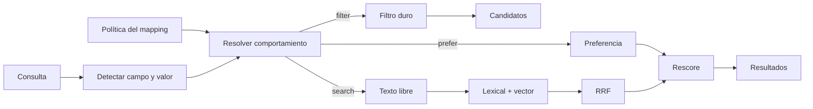

# Ranking configurable por negocio

El Gateway no hardcodea “prioridad por colección” ni sinónimos de un vertical. El mapping controla campos, filtros, preferencias y pesos; una [política de retrieval](/concepts/retrieval-policies) versionada puede reemplazar los sinónimos en query-time.

## Flujo de una consulta



1. Extracción NL (y/o args MCP / `filters` / `preferences` del request).
2. Cada match se resuelve con `retrieval.inferredBehavior` del campo.
3. Búsqueda híbrida (FTS + embeddings) y fusión RRF.
4. **Rescore** con boosts blandos acotados (no pueden dominar el ranking).

## Tres intenciones

| Intención | Dónde | Efecto |
| --- | --- | --- |
| **Filtro duro** | `filters` del request, args MCP del campo, o NL con `inferredBehavior: "filter"` | Excluye lo que no cumple |
| **Preferencia** | `preferences` del request, `prefer_<campo>` en MCP, o NL con `inferredBehavior: "prefer"` | Sube score; **no excluye** |
| **Solo búsqueda** | NL con `inferredBehavior: "search"`, o campo solo `searchable` | Queda en texto libre / FTS |

## Política por campo (`retrieval`)

```json
{
  "name": "collections",
  "sourceColumn": "collections",
  "type": "json",
  "aliases": ["colección", "colecciones", "collection"],
  "searchable": true,
  "filterable": true,
  "retrieval": {
    "cardinality": "many",
    "match": "contains",
    "inferredBehavior": "prefer",
    "boost": 0.35,
    "searchWeight": "B"
  }
}
```

| Clave | Valores | Notas |
| --- | --- | --- |
| `cardinality` | `one` \| `many` | Con `many`, el índice guarda **arrays** (no CSV). Match típico: `contains` |
| `match` | `eq`, `contains`, `containsAny`, `containsAll` | Op por defecto al filtrar / preferir ese campo |
| `inferredBehavior` | `filter` \| `prefer` \| `search` | Qué hace el Gateway cuando el valor aparece en lenguaje natural |
| `boost` | `0`–`1` | Soft boost por preferencia (se acumula con tope interno) |
| `searchWeight` | `A`–`D` | Peso léxico PostgreSQL (`A` más fuerte). Default `D` |

Campos `sensitive` **no** participan en filtros, preferencias ni boosts.

### Ejemplo: excluir vs priorizar

**Excluir** (solo productos en la colección):

```bash
curl -X POST "https://data.whaapy.com/query" \
  -H "Authorization: Bearer $WORKSPACE_KEY" \
  -H "Content-Type: application/json" \
  -d '{
    "query": "tela antimancha",
    "sourceId": "{source_id}",
    "filters": [
      { "field": "collections", "op": "contains", "value": "Verano" }
    ]
  }'
```

**Priorizar** (Verano arriba, pero otros siguen candidatos):

```bash
curl -X POST "https://data.whaapy.com/query" \
  -H "Authorization: Bearer $WORKSPACE_KEY" \
  -H "Content-Type: application/json" \
  -d '{
    "query": "tela antimancha",
    "sourceId": "{source_id}",
    "preferences": [
      { "field": "collections", "op": "contains", "value": "Verano", "boost": 0.3 }
    ]
  }'
```

**Delegar al mapping** (NL): con `inferredBehavior: "prefer"` y alias `colección`, una query como `"colección Polares"` produce `applied_preferences` automáticamente, sin `filters`.

La respuesta incluye:

- `applied_filters`
- `applied_preferences` (si hubo boosts)
- `query_type`: `filter_only` \| `lexical` \| `hybrid_search`

## Valores multivalor

Para campos con `cardinality: "many"`:

- En indexación se canonicalizan desde **array**, CSV legacy o escalar.
- En SQL, `contains` / `containsAny` / `containsAll` operan sobre JSONB (y toleran CSV viejo).
- Un producto en `["Verano", "Ofertas"]` **sí** cumple `contains: "Verano"`.

En Shopify, `collections` y `tags` se materializan como arrays en el transform del conector.

## Sinónimos y pesos RRF (por entidad)

Vocabulario **del negocio**, no global:

```json
"retrieval": {
  "synonyms": {
    "version": "v1",
    "entries": {
      "vinipiel": ["piel sintetica", "ecocuero"],
      "retapizar": ["tapiceria", "tapizar"]
    }
  },
  "rrf": {
    "lexicalWeight": 1,
    "vectorWeight": 1.1
  },
  "softPreferences": []
}
```

- Los sinónimos expanden **solo la query léxica** (no el texto de embedding).
- Para vocabulario nuevo, usa la [API de políticas](/onboarding/synonym-updates): no requiere reindex ni cambia `agent_ready`.
- Los sinónimos del mapping quedan como fallback legacy si no hay una policy activa para la entidad.
- Cambiar `searchWeight`, campos `searchable` o reglas sí exige mapping + **reindex**.
- Regenerar embeddings solo si cambió `embeddingTextTemplate` (o datos del template).

## Tools MCP

Para cada campo `filterable`:

- Arg del campo → **filtro duro** (con `match` del mapping; arrays si `cardinality: many`).
- Si `inferredBehavior: "prefer"`, también se genera `prefer_<campo>` → **preferencia blanda**.

La descripción del tool indica si el campo, en NL, prioriza sin excluir.

## Evals recomendados

Cubre al menos:

1. Colección / categoría como **hard filter** (`mustApplyFilters` + IDs esperados).
2. Mismo campo como **preferencia** (`mustApplyPreferences` + `mustRankAbove`).
3. Producto **multi-colección** (contains no rompe).
4. Campo en source no-Shopify (brand/category) para validar que no es tipado a Shopify.
5. Sin policy (`retrieval` ausente) → comportamiento legacy (`filter` / `eq`).

Detalle de aserciones en [Evals](/concepts/evals-quality-gate) y el [Checklist de Activación](/onboarding/activation-checklist).

## Checklist operativo

1. Declara `retrieval` en el mapping (y `aliases` en el idioma de tus usuarios).
2. `POST /sources/:id/mapping` → nueva versión.
3. `POST /sources/:id/index` (obligatorio si cambian pesos, cardinalidad o searchable).
4. Smoke `POST /query` con filter, preference y NL.
5. Evals + activate.

Fixtures de referencia en el repo:

- Ecommerce genérico: `fixtures/shopify-mapping.json`
- Ejemplo textil con sinónimos: `fixtures/bayon-mapping.json`
- Casos de eval de ranking: `fixtures/ranking-eval-cases.example.json`
